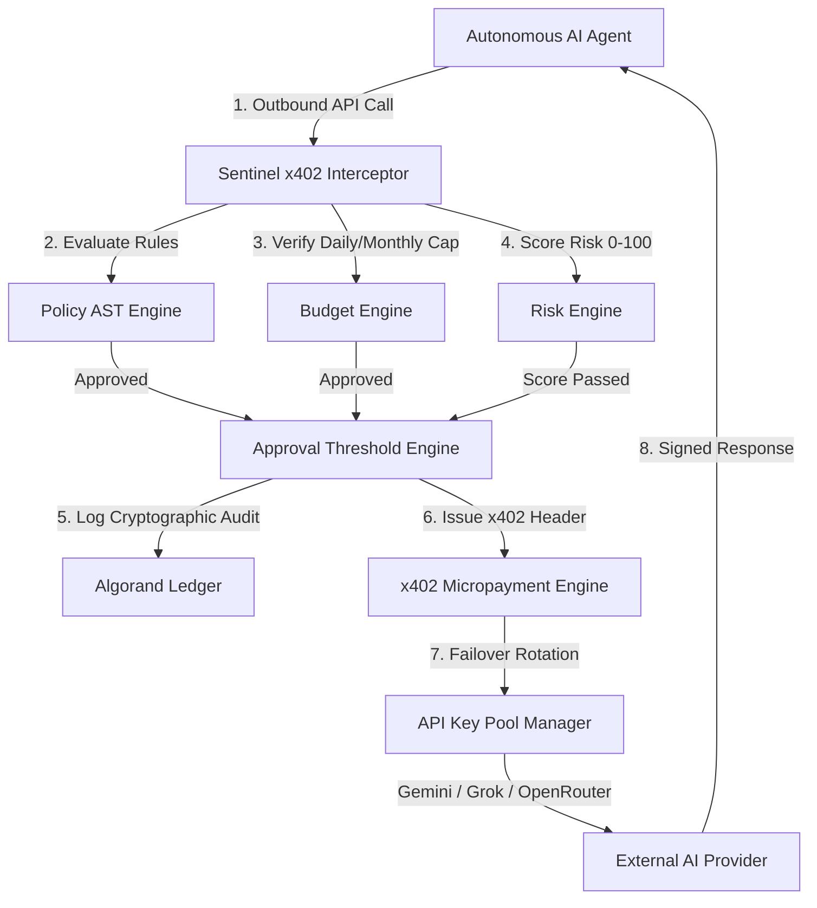
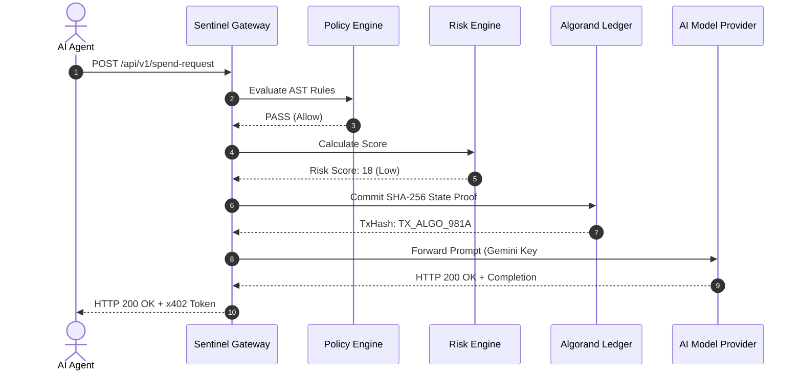

# 🏛️ Sentinel AI — Technical Architecture & Diagrams

This document details the system design, database schemas, sequence diagrams, and API contracts for **Sentinel AI**.

---

## 🏗️ System Architecture

---

## 🗄️ Database Entity-Relationship (ER) Diagram

```mermaid
erDiagram
    USERS ||--o{ AGENTS : owns
    DEPARTMENTS ||--o{ AGENTS : scopes
    AGENTS ||--o{ SPEND_REQUESTS : initiates
    POLICIES ||--o{ AGENTS : governs
    AGENTS ||--o{ BUDGETS : allocates
    SPEND_REQUESTS ||--o| APPROVALS : requires
    SPEND_REQUESTS ||--o| RISK_REPORTS : generates
    SPEND_REQUESTS ||--o| BLOCKCHAIN_RECORDS : logs
    API_KEY_POOLS ||--o{ PROVIDER_LOGS : tracks

    USERS {
        uuid id PK
        string email
        string password_hash
        string role_name
    }
    AGENTS {
        uuid id PK
        string name
        float daily_budget
        float monthly_budget
        string status
    }
    POLICIES {
        uuid id PK
        string name
        string action
        json condition_ast
    }
    SPEND_REQUESTS {
        uuid id PK
        float amount
        string vendor
        string status
        int risk_score
    }
    BLOCKCHAIN_RECORDS {
        uuid id PK
        string algorand_tx_hash
        int block_number
        string payload_hash
    }
```

---

## 🔄 End-to-End Sequence Diagram

---

## 🔌 API Reference Endpoints

| Endpoint | Method | Description |
| :--- | :--- | :--- |
| `/api/v1/auth/register` | `POST` | Register a new admin/manager account |
| `/api/v1/auth/login` | `POST` | JWT authentication and access token issue |
| `/api/v1/agents` | `GET/POST` | List or register an autonomous AI agent |
| `/api/v1/policies` | `GET/POST` | Fetch or construct AST spend policies |
| `/api/v1/spend-request` | `POST` | Submit agent spend request through governance pipeline |
| `/api/v1/approval` | `POST` | Approve or reject pending spend requests |
| `/api/v1/blockchain` | `GET` | Retrieve Algorand state proof records |
| `/api/v1/providers` | `GET` | Monitor AI Provider 5-key pool failover status |
